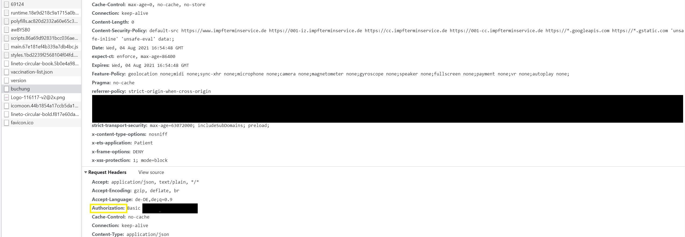

"# impfung" 

# Content of this repository

This repo contains Scripts that might help you get an appointment
for your corona vaccination in Baden Württemberg, Germany.
This program got me my vaccination appointment.
It consists of 2 Parts:
1. code_bekommen
2. termin_bekommen

# Steps of code_bekommen
<b>Step 1: </b>
Change "bdate" in code_bekommen to your birthdate.

<b>Step 2:</b>
Change "location_url_dict" in code_bekommen to use the URLs of 
your vaccination centers.

<b>Step 3:</b>
Execute "code_bekommen". If you get an audio notification, you got a chance
to get your registration code. You better be fast now!
This script will have opened a chrome browser for you. Your birthday
will already have been entered.

# Steps of termin_bekommen
<b>Step 1:</b>
Get your authorization credentials for the API.
For doing this open chrome, press F12,
head to the "network" tab. Then enter the URL from your
E-Mail which you got after code_bekommen. This URL must contain
your registration code. Then check "buchung". The request header will
contain your authorization credentials to access the API.
Example Image:

<b>Step 2:</b>
Change or add dictionaries to the list "info_list".
Each dict must contain all the data referenced by the dictionary
keys. The list already contains example dictionaries.

<b>Step 3:</b>
Execute the script and hope you will get your appointment fast.
 
### This repo will not be maintained and updated as I already got my vaccination